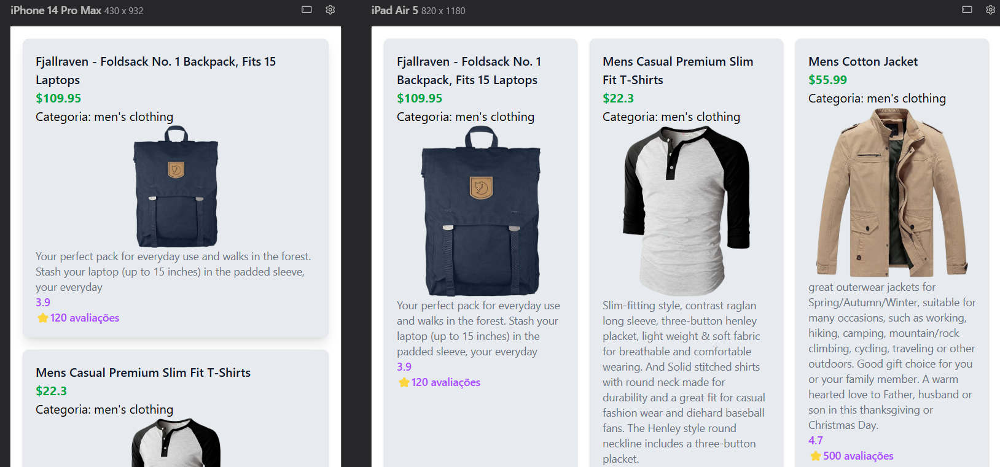

# Exercício - Fake Store API

Aplicação simples em React + TypeScript que consome a [Fake Store API](https://fakestoreapi.com/products) para listar produtos.

> Projeto desenvolvido como exercício de prática, durante a formação fullstack **Dev em Dobro**. Focado em consumo de API externa com tipagem TypeScript.

## 🛍️ Sobre o projeto

<<<<<<< HEAD
Lista os produtos retornados pela Fake Store API em formato de cards, exibindo nome, preço, categoria, imagem, descrição e avaliação de cada item.

## ⚙️ Funcionalidades

- Consumo da API via `fetch` com `useEffect`
- Estado de carregamento (loading) enquanto os dados são buscados
- Listagem dos produtos em cards, com grid responsivo (1 a 4 colunas dependendo da tela)
- Exibição de nome, preço, categoria, imagem, descrição e nota/avaliações
- Tipagem completa das respostas da API com TypeScript (interface `Product`)
- Estilização com Tailwind CSS
=======
Lista os produtos retornados pela Fake Store API em formato de cards, exibindo nome, preço, categoria, descrição e avaliação de cada item.

## ⚙️ Funcionalidades

- Consumo da API via `fetch`
- Listagem dos produtos em cards
- Exibição de nome, preço, categoria, descrição e nota/avaliações
- Tipagem das respostas da API com TypeScript
- Estilização responsiva com Tailwind CSS
>>>>>>> ef856b0dd0794ae5f49d9ba564a0954c58588e77

## 🛠️ Tecnologias

- React
- TypeScript
- Tailwind CSS

## 🚀 Como rodar localmente

```bash
git clone https://github.com/marcormsilva/exercico-buscar-dados-api-fakestore.git
cd exercico-buscar-dados-api-fakestore
npm install
npm run dev
```

## 📸 Preview

<<<<<<< HEAD



## 📚 Aprendizados

Exercício focado em praticar requisições HTTP com `useEffect`, controle de estado de carregamento, e tipagem de dados vindos de uma API externa em TypeScript, com estilização usando Tailwind.
=======


## 📚 Aprendizados

Exercício focado em praticar requisições HTTP e tipagem de dados vindos de uma API externa em TypeScript, com estilização usando Tailwind.
>>>>>>> ef856b0dd0794ae5f49d9ba564a0954c58588e77

## 🔗 Contato

- [LinkedIn](https://www.linkedin.com/in/marco-rm-silva/)
- [GitHub](https://github.com/marcormsilva)